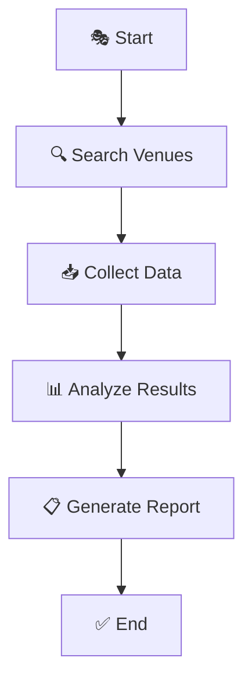
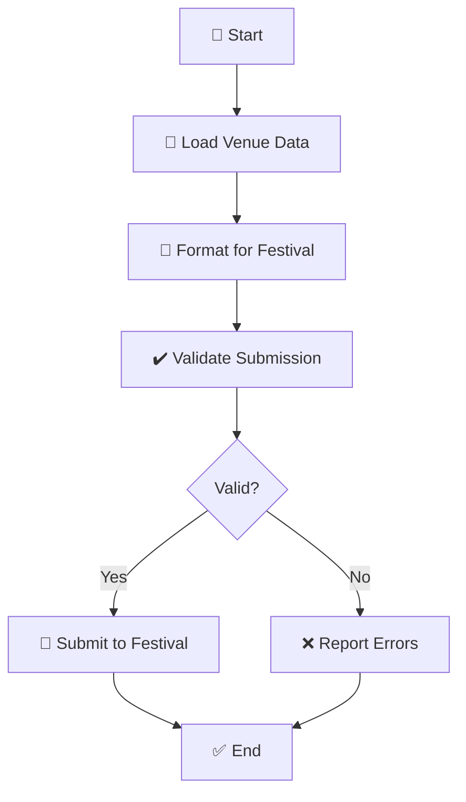

# 🎭 Venue Research Agent

A comprehensive research and analysis tool for venue discovery and evaluation.

## ✨ Features

- 🔍 **Venue Discovery**: Search and identify venues based on custom criteria
- 🤖 **Research Automation**: Automated data collection and analysis
- 🧠 **Agent-Based Processing**: Intelligent agent systems for complex research tasks
- 📊 **Data Analysis**: Comprehensive venue evaluation and comparison

## 🚀 Getting Started

### Prerequisites
- 🐍 Python 3.11+
- 📦 Required dependencies (see `requirements.txt`)
- 🔧 Make (optional but recommended)

### Quick Start with Make

Both projects include comprehensive Makefiles for easy setup and operation:

```bash
# Venue Scout
cd venue-scout
make help          # See all available commands
make setup         # Complete setup (venv + dependencies + database)
make wizard        # Run setup wizard

# Festival Submit
cd festival-submit
make help          # See all available commands
make setup         # Complete setup (venv + dependencies + database)
make acts          # List configured acts
```

### Manual Installation

```bash
git clone https://github.com/michaelcolletti/venue-research-agent.git
cd venue-research-agent
pip install -r requirements.txt
```

## 📁 Project Structure

```
venue-research-agent/
├── src/              # Source code
├── tests/            # Test suite
├── data/             # Data files
└── README.md         # This file
```

## 🤝 Contributing

Contributions are welcome! Please submit pull requests with clear descriptions.

## 📜 License

See LICENSE file for details.

## 🔧 Virtual Environment Setup

```bash
# Create virtual environment
python -m venv venv

# Activate virtual environment
# On macOS/Linux:
source venv/bin/activate
# On Windows:
venv\Scripts\activate

# Install dependencies
pip install -r requirements.txt

# Deactivate when done
deactivate
```

## 🔗 Related Projects

### 🎪 Festival Submit
A companion project for submitting venue research to festivals.

```bash
git clone https://github.com/michaelcolletti/festival-submit.git
cd festival-submit
pip install -r requirements.txt
```

## 🏗️ Architecture Diagrams

### Venue Research Agent Flow



### Festival Submit Flow



